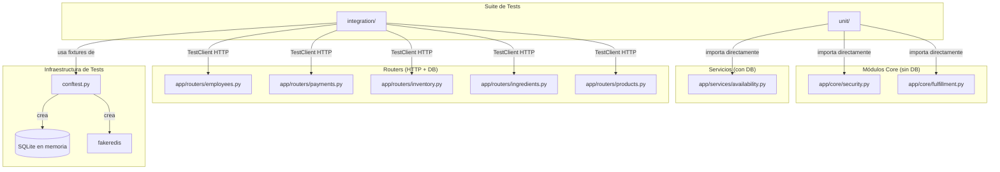
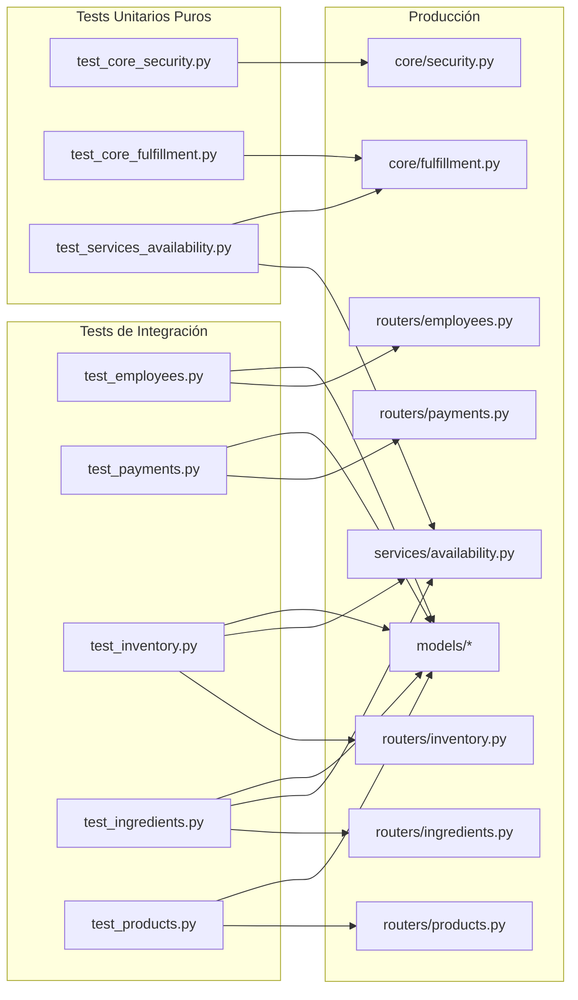
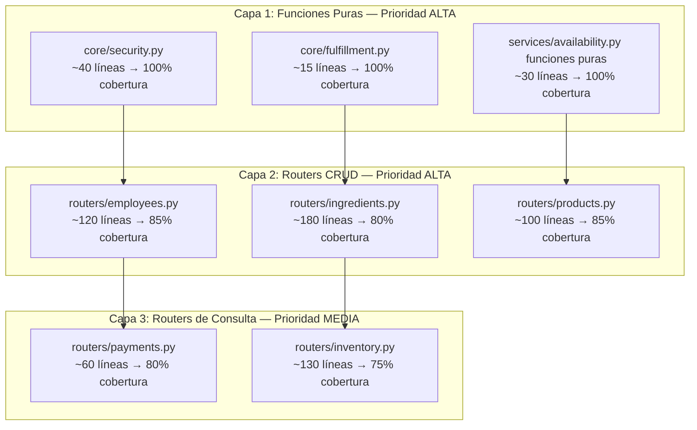

# Documento de Diseño: backend-unit-test-coverage

## Visión General

Estrategia de alto nivel para elevar la cobertura de tests unitarios del backend CoffeeAndChill (FastAPI + Python 3.11) desde el 68.93% actual (1216/1764 líneas) hasta superar el umbral del 80% requerido por SonarQube. El plan cubre los módulos sin tests existentes, define la arquitectura de la suite, los patrones de testing por capa y la priorización de brechas.

La cobertura objetivo es alcanzable añadiendo aproximadamente 195 líneas cubiertas adicionales (de 548 sin cubrir), lo que equivale a cubrir los módulos de mayor densidad de lógica de negocio: servicios puros, routers de CRUD y funciones core.

---

## Arquitectura de la Suite de Tests

### Estructura de archivos nuevos

```
tests/
├── conftest.py                        # (existente — fixtures base)
├── test_auth.py                       # (existente)
├── test_catalog.py                    # (existente)
├── test_orders.py                     # (existente)
├── test_fulfillment.py                # (existente)
├── test_tables.py                     # (existente)
├── test_workshops.py                  # (existente)
│
├── unit/                              # Tests unitarios puros (sin DB)
│   ├── __init__.py
│   ├── test_core_security.py          # hash_password, verify_password, create_*_token, decode_token
│   ├── test_core_fulfillment.py       # resolve_effective_fulfillment, FulfillmentType
│   └── test_services_availability.py  # should_decrement_*, should_record_*, get_product_cupo_by_stock_field
│
└── integration/                       # Tests de integración (con DB SQLite en memoria)
    ├── __init__.py
    ├── test_employees.py              # CRUD empleados, cambio de status
    ├── test_payments.py               # Historial de pagos con filtros de fecha
    ├── test_inventory.py              # GET paginado, ajustes, movimientos
    ├── test_ingredients.py            # CRUD insumos, ajustes de stock, recetas
    └── test_products.py               # CRUD productos, upload imagen, cambio de status
```

> **Nota de convención**: Los tests en `unit/` no usan `client` ni `session` — solo importan y llaman funciones directamente. Los tests en `integration/` reutilizan los fixtures `client`, `session` y `test_data` de `conftest.py`.

---

## Arquitectura General



---

## Diagrama de Dependencias: Módulos de Test → Módulos de Producción



---

## Componentes y Módulos a Cubrir

### Prioridad 1 — Funciones Puras (mayor ROI de cobertura, sin fixtures)

#### `app/core/security.py`

| Función | Casos a cubrir |
|---|---|
| `hash_password(password)` | Retorna string no vacío; dos llamadas con mismo input producen hashes distintos |
| `verify_password(plain, hashed)` | Contraseña correcta → True; contraseña incorrecta → False |
| `create_access_token(user_id, role)` | Retorna JWT decodificable; payload contiene `sub`, `role`, `type=access` |
| `create_refresh_token(user_id, role)` | Payload contiene `type=refresh`; expiración mayor que access token |
| `decode_token(token)` | Token válido → dict con claims; token inválido/expirado → None |

#### `app/core/fulfillment.py`

| Función | Casos a cubrir |
|---|---|
| `resolve_effective_fulfillment(ft, has_recipe)` | Sin receta → siempre STOCK; con receta STOCK → STOCK; con receta INGREDIENTS → INGREDIENTS; con receta BOTH → BOTH |

#### `app/services/availability.py` (funciones puras / sin DB)

| Función | Casos a cubrir |
|---|---|
| `should_decrement_product_stock(ft, has_recipe)` | Sin receta → True; INGREDIENTS con receta → False; STOCK con receta → True; BOTH con receta → True |
| `should_record_product_inventory_movement(ft, has_recipe)` | Misma matriz que la anterior |
| `get_product_cupo_by_stock_field(product)` | stock_quantity positivo → valor; stock_quantity 0 → 0; stock_quantity None → 0 |

---

### Prioridad 2 — Routers con lógica de negocio densa

#### `app/routers/employees.py`

| Endpoint | Casos a cubrir |
|---|---|
| `GET /admin/employees` | Lista vacía; lista con empleados; requiere permiso `employees:manage` |
| `POST /admin/employees` | Creación exitosa; email duplicado → 409; rol inválido → 400; rol no existente se crea |
| `PUT /admin/employees/{id}` | Actualización parcial; empleado no encontrado → 404; email duplicado → 409 |
| `PATCH /admin/employees/{id}/status` | Activar/desactivar; auto-desactivación → 400; empleado no encontrado → 404 |

#### `app/routers/ingredients.py`

| Endpoint | Casos a cubrir |
|---|---|
| `GET /ingredients` | Lista activos; `active_only=false` incluye inactivos |
| `POST /ingredients` | Creación exitosa; stock inicial = 0 |
| `GET /ingredients/{id}` | Encontrado con stock calculado; no encontrado → 404 |
| `PATCH /ingredients/{id}` | Actualización parcial; no encontrado → 404 |
| `POST /ingredients/adjustments` | Ajuste positivo (IN); ajuste negativo (OUT); stock insuficiente → 400; insumo no encontrado → 404 |
| `GET /ingredients/products/{id}/consumption` | Sin receta → lista vacía; con receta → items |
| `POST /ingredients/products/{id}/consumption` | Upsert reemplaza receta; lista vacía → limpia receta; insumo inactivo → 400; producto no encontrado → 404 |

#### `app/routers/products.py`

| Endpoint | Casos a cubrir |
|---|---|
| `POST /products` | Creación exitosa; precio ≤ 0 → 400; stock negativo → 400; categoría no encontrada → 404; fulfillment_type inválido → 400 |
| `PATCH /products/{id}` | Actualización parcial; producto no encontrado → 404; precio inválido → 400 |
| `PATCH /products/{id}/status` | ACTIVE/INACTIVE; estado inválido → 400; no encontrado → 404 |
| `POST /products/upload-image` | Tipo MIME inválido → 400; archivo > 5MB → 400; subida exitosa → URL |

---

### Prioridad 3 — Routers con lógica de consulta/filtrado

#### `app/routers/payments.py`

| Endpoint | Casos a cubrir |
|---|---|
| `GET /payments` | Sin pagos → lista vacía con summary en ceros; con pagos del día; filtro de fecha válido; fecha inválida → usa hoy; paginación (limit/offset) |

#### `app/routers/inventory.py`

| Endpoint | Casos a cubrir |
|---|---|
| `GET /inventory` | Paginación (page/limit); filtro por category_id; low_stock_count correcto |
| `POST /inventory/adjustments` | Ajuste positivo; ajuste negativo; stock insuficiente → 400; producto no encontrado → 404 |
| `GET /inventory/movements` | Sin filtros; filtro por movement_type; filtro por product_id; filtro por fechas; paginación |

---

## Patrones de Testing

### 1. Tests Unitarios Puros (sin fixtures de DB)

```python
# tests/unit/test_core_security.py
import pytest
from app.core.security import hash_password, verify_password, create_access_token, decode_token

def test_hash_password_returns_non_empty_string():
    result = hash_password("mypassword")
    assert isinstance(result, str) and len(result) > 0

def test_hash_password_is_non_deterministic():
    h1 = hash_password("same")
    h2 = hash_password("same")
    assert h1 != h2  # bcrypt usa salt aleatorio

def test_verify_password_correct():
    hashed = hash_password("secret")
    assert verify_password("secret", hashed) is True

def test_verify_password_wrong():
    hashed = hash_password("secret")
    assert verify_password("wrong", hashed) is False

@pytest.mark.parametrize("user_id,role", [(1, "admin"), (42, "client"), (99, "waiter")])
def test_create_access_token_payload(user_id, role):
    token = create_access_token(user_id, role)
    payload = decode_token(token)
    assert payload["sub"] == str(user_id)
    assert payload["role"] == role
    assert payload["type"] == "access"

def test_decode_token_invalid_returns_none():
    assert decode_token("not.a.valid.token") is None
```

### 2. Parametrize para matrices de lógica booleana

```python
# tests/unit/test_core_fulfillment.py
import pytest
from app.core.fulfillment import resolve_effective_fulfillment

@pytest.mark.parametrize("ft,has_recipe,expected", [
    ("STOCK",       False, "STOCK"),
    ("INGREDIENTS", False, "STOCK"),   # sin receta siempre STOCK
    ("BOTH",        False, "STOCK"),
    ("STOCK",       True,  "STOCK"),
    ("INGREDIENTS", True,  "INGREDIENTS"),
    ("BOTH",        True,  "BOTH"),
])
def test_resolve_effective_fulfillment(ft, has_recipe, expected):
    assert resolve_effective_fulfillment(ft, has_recipe) == expected
```

### 3. Fixtures de integración con helpers de autenticación

```python
# tests/integration/test_employees.py
import pytest
from fastapi.testclient import TestClient
from sqlmodel import Session, select
from app.models.security import Role, SystemUser
from app.core.security import hash_password

@pytest.fixture
def admin_token(client: TestClient, test_data) -> str:
    """Fixture reutilizable: devuelve Bearer token de admin."""
    r = client.post("/auth/login", json={"email": "admin@example.com", "password": "adminpass"})
    assert r.status_code == 200
    return r.json()["access_token"]

@pytest.fixture
def admin_headers(admin_token: str) -> dict:
    return {"Authorization": f"Bearer {admin_token}"}

def test_get_employees_empty(client: TestClient, admin_headers: dict, test_data):
    r = client.get("/admin/employees", headers=admin_headers)
    assert r.status_code == 200
    assert isinstance(r.json(), list)

def test_create_employee_success(client: TestClient, session: Session, admin_headers: dict, test_data):
    r = client.post("/admin/employees", headers=admin_headers, json={
        "full_name": "Juan Pérez",
        "email": "juan@cafe.com",
        "password": "pass1234",
        "role": "waiter",
    })
    assert r.status_code == 201
    data = r.json()
    assert data["email"] == "juan@cafe.com"
    assert data["role"] == "waiter"
    assert data["is_active"] is True

def test_create_employee_duplicate_email(client: TestClient, admin_headers: dict, test_data):
    payload = {"full_name": "X", "email": "admin@example.com", "password": "p", "role": "waiter"}
    r = client.post("/admin/employees", headers=admin_headers, json=payload)
    assert r.status_code == 409
```

### 4. Fixtures de datos de dominio reutilizables

```python
# Patrón: fixture de sesión que crea entidades de dominio
@pytest.fixture
def ingredient_with_stock(session: Session, test_data):
    """Crea un insumo con 500g de stock inicial."""
    from app.models.inventory import Ingredient, IngredientStockMovement
    from sqlmodel import select
    from app.models.security import SystemUser

    admin = session.exec(select(SystemUser).where(SystemUser.email == "admin@example.com")).first()
    ing = Ingredient(name="Café molido", unit="g", min_stock=100, is_active=True)
    session.add(ing)
    session.commit()
    session.refresh(ing)
    session.add(IngredientStockMovement(
        ingredient_id=ing.ingredient_id,
        system_user_id=admin.system_user_id,
        movement_type="IN",
        quantity=500.0,
        notes="stock inicial test",
    ))
    session.commit()
    return ing
```

### 5. Mocking de dependencias externas

```python
# Para upload de imagen: mockear os.makedirs y open
from unittest.mock import patch, MagicMock
import io

def test_upload_image_success(client: TestClient, admin_headers: dict, test_data):
    with patch("app.routers.products.os.makedirs"), \
         patch("builtins.open", MagicMock()):
        r = client.post(
            "/products/upload-image",
            headers=admin_headers,
            files={"file": ("photo.jpg", io.BytesIO(b"fake-image-data"), "image/jpeg")},
        )
    assert r.status_code == 200
    assert "image_url" in r.json()

def test_upload_image_invalid_type(client: TestClient, admin_headers: dict, test_data):
    r = client.post(
        "/products/upload-image",
        headers=admin_headers,
        files={"file": ("doc.pdf", io.BytesIO(b"data"), "application/pdf")},
    )
    assert r.status_code == 400
```

---

## Estrategia de Cobertura por Capa



### Estimación de líneas cubiertas por módulo

| Módulo | Líneas sin cubrir (est.) | Cobertura objetivo | Líneas nuevas cubiertas |
|---|---|---|---|
| `core/security.py` | ~35 | 100% | ~35 |
| `core/fulfillment.py` | ~12 | 100% | ~12 |
| `services/availability.py` (funciones puras) | ~25 | 95% | ~24 |
| `routers/employees.py` | ~110 | 85% | ~94 |
| `routers/ingredients.py` | ~160 | 80% | ~128 |
| `routers/products.py` | ~90 | 85% | ~77 |
| `routers/payments.py` | ~55 | 80% | ~44 |
| `routers/inventory.py` | ~120 | 75% | ~90 |
| **Total estimado** | **~607** | — | **~504** |

Con 504 líneas adicionales cubiertas sobre las 1216 actuales → **~1720/1764 = ~97.5%** (conservadoramente, apuntando a ≥80% con margen).

---

## Componentes e Interfaces de la Suite

### Fixture `admin_headers` (compartido)

**Propósito**: Proveer headers de autenticación de admin para todos los tests de integración que requieren permisos elevados.

**Interfaz**:
```python
@pytest.fixture
def admin_headers(client: TestClient, test_data) -> dict[str, str]:
    """Retorna {'Authorization': 'Bearer <token>'} para el usuario admin."""
```

**Responsabilidades**:
- Hacer login con credenciales del admin de `test_data`
- Retornar el header listo para usar en `client.get/post/patch/put`

### Fixture `employee_headers` (compartido)

**Propósito**: Proveer headers de un empleado con rol `waiter` o `cashier` para tests que requieren permisos específicos.

```python
@pytest.fixture
def employee_headers(client: TestClient, session: Session, test_data) -> dict[str, str]:
    """Crea un empleado waiter y retorna su token."""
```

### Helper `_login(client, email, password) -> str`

**Propósito**: Función utilitaria (no fixture) para obtener tokens en tests que necesitan múltiples usuarios.

```python
def _login(client: TestClient, email: str, password: str) -> str:
    r = client.post("/auth/login", json={"email": email, "password": password})
    assert r.status_code == 200
    return r.json()["access_token"]
```

---

## Modelos de Datos de Test

### Entidades base (ya en `conftest.py`)

```
Role(admin) → SystemUser(admin@example.com)
Customer(customer@example.com)
```

### Entidades adicionales por módulo de test

```
test_employees.py:
  Role(waiter), Role(cashier) → SystemUser(empleados de prueba)

test_ingredients.py:
  Ingredient(activo, con stock) → IngredientStockMovement(IN)
  Ingredient(inactivo)
  Product + ProductConsumption (receta)

test_products.py:
  Category → Product(STOCK), Product(INGREDIENTS), Product(BOTH)

test_inventory.py:
  Category → Product → InventoryMovement(IN/OUT/SALE)

test_payments.py:
  Order → Payment (con fecha de hoy y de ayer)
```

---

## Manejo de Errores en Tests

### Escenarios de error a cubrir obligatoriamente

| Código HTTP | Escenario | Módulo |
|---|---|---|
| 400 | Precio ≤ 0 | products |
| 400 | Stock negativo | products |
| 400 | fulfillment_type inválido | products |
| 400 | Estado inválido (no ACTIVE/INACTIVE) | products |
| 400 | Stock insuficiente en ajuste | inventory, ingredients |
| 400 | Auto-desactivación de cuenta propia | employees |
| 400 | Insumo inactivo en receta | ingredients |
| 400 | Imagen > 5MB o tipo MIME inválido | products |
| 404 | Recurso no encontrado | todos los routers |
| 409 | Email duplicado | employees |

---

## Estrategia de Testing

### Enfoque por tipo de test

**Tests Unitarios Puros** (`tests/unit/`):
- Sin fixtures de DB ni cliente HTTP
- Importación directa de funciones
- Uso intensivo de `@pytest.mark.parametrize` para matrices de casos
- Ejecución instantánea (< 1s por módulo)
- Cobertura de todas las ramas de lógica booleana

**Tests de Integración** (`tests/integration/`):
- Usan `client` (TestClient) y `session` (SQLite en memoria) de `conftest.py`
- Cada test es independiente: la DB se recrea por fixture `session`
- Patrón: Arrange (crear datos) → Act (llamada HTTP) → Assert (status + body)
- No mockean la DB; sí mockean filesystem (upload de imagen) y Redis (ya en conftest)

### Librería de property-based testing

Para las funciones puras de `availability.py` y `fulfillment.py`, se puede usar **Hypothesis** para generar casos de borde automáticamente:

```python
# Ejemplo con Hypothesis
from hypothesis import given, strategies as st
from app.services.availability import get_product_cupo_by_stock_field

@given(st.integers(min_value=0, max_value=10_000))
def test_cupo_never_negative(stock_qty):
    from unittest.mock import MagicMock
    product = MagicMock()
    product.stock_quantity = stock_qty
    assert get_product_cupo_by_stock_field(product) >= 0
```

### Ejecución y reporte de cobertura

```bash
# Ejecutar todos los tests con cobertura
pytest tests/ --cov=app --cov-report=xml:coverage.xml --cov-report=term-missing

# Solo tests unitarios (rápido, sin DB)
pytest tests/unit/ -v

# Solo tests de integración
pytest tests/integration/ -v

# Con umbral mínimo (falla si < 80%)
pytest tests/ --cov=app --cov-fail-under=80 --cov-report=xml:coverage.xml
```

---

## Consideraciones de Rendimiento

- Los tests unitarios puros no tienen overhead de DB; deben completar en < 100ms cada uno.
- Los tests de integración recrean el schema SQLite por cada fixture `session`; mantener fixtures al mínimo necesario para evitar lentitud.
- Usar `@pytest.fixture(scope="module")` para fixtures de solo lectura (ej. roles) cuando sea seguro compartirlos entre tests del mismo módulo.
- Evitar `scope="session"` en fixtures que mutan datos para prevenir contaminación entre tests.

---

## Consideraciones de Seguridad

- Los tests no deben hardcodear tokens JWT reales ni secrets de producción.
- Las credenciales de test (`adminpass`, `customerpass`) solo existen en la DB SQLite en memoria y no se persisten.
- El archivo `sonar-project.properties` contiene un token de SonarQube; no incluir en cobertura de tests ni en logs de CI.
- Los tests de upload de imagen deben usar `io.BytesIO` con datos sintéticos, nunca archivos reales del filesystem.

---

## Dependencias

| Dependencia | Uso | Ya instalada |
|---|---|---|
| `pytest` | Framework de tests | ✅ |
| `pytest-cov` | Reporte de cobertura | ✅ (genera coverage.xml) |
| `httpx` / `fastapi[testclient]` | TestClient | ✅ |
| `fakeredis` | Mock de Redis en tests | ✅ |
| `sqlmodel` | ORM + SQLite en memoria | ✅ |
| `hypothesis` | Property-based testing (opcional) | ⬜ `pip install hypothesis` |
| `unittest.mock` | Mock de filesystem/OS | ✅ (stdlib) |
